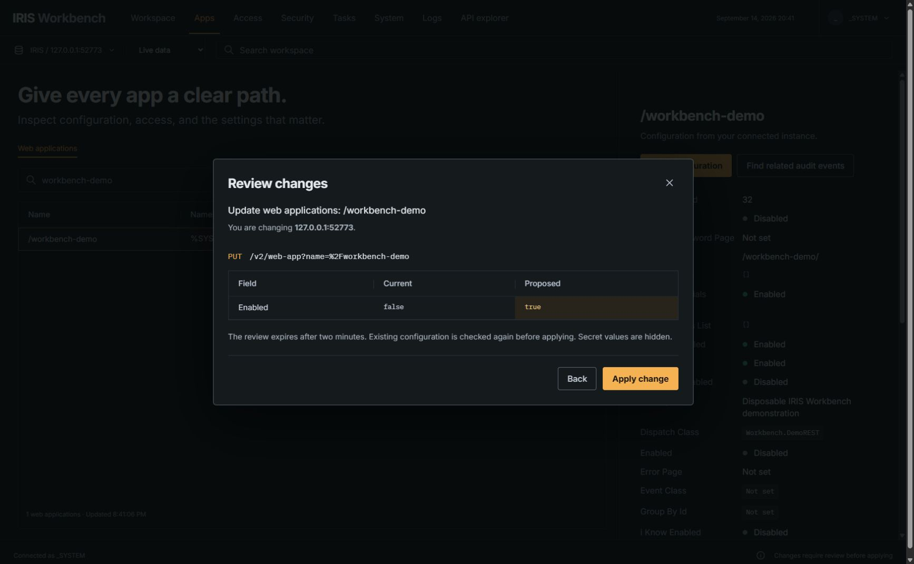
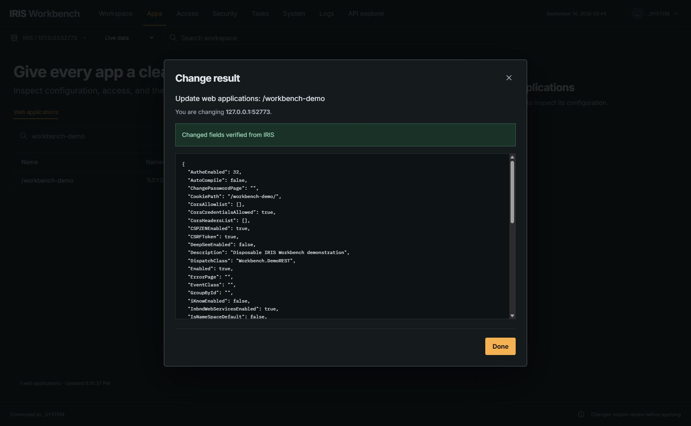

# Demonstration: bring a local service online

This is a real local IRIS workflow. The service is deliberately disposable, and sample design mode is not used.

## Prepare

Complete the README setup and start Workbench. The installer includes the harmless `Workbench.DemoREST` class. In the app directory, using the same private state directory from setup:

```powershell
node scripts/demo.mjs setup C:/path/to/private/workbench-state
node scripts/demo.mjs check C:/path/to/private/workbench-state
```

Setup creates `/workbench-demo` disabled, with password authentication and `%Admin_Operate` access. It refuses to overwrite an existing application. Check sends an authenticated request to the local service and prints only its status and response, never credentials. The disabled service should return HTTP 404.

## Demonstrate the change

1. Open [local Workbench](http://127.0.0.1:3411), connect and select Live data.
2. Open Apps and filter for `workbench-demo`.
3. Select the application and inspect its namespace, dispatch class and disabled state.
4. Choose Edit configuration, change Enabled to true, then choose Review changes.
5. Check that the review contains the intended field. Apply the change.
6. Confirm the result reports that changed fields were verified from IRIS.
7. Run the same check command again. It should return HTTP 200 with `{"service":"Workbench demonstration","status":"ready"}`.
8. Open Workspace to inspect the session's applied change. Open Logs to inspect the actual instance's available evidence. Audit visibility depends on IRIS audit settings.

The demo separates a successful configuration write from a responding service. There is no invented availability score or automatic rollback.

## Show the rest of the portal

In Access, inspect users, roles and resources. In Security, inspect wallet collections, certificate metadata, TLS and OAuth configuration. In Tasks, inspect schedules and execution history. In System, inspect processes and capacity with explicit units. In Logs, switch sources, choose a rotation, load older events and return to the latest page. The read API explorer exposes the organizer's documented endpoints and preserves IRIS permission checks.

See [verification](VERIFICATION.md) for the representative lifecycle tests performed across these areas. A task run request was independently checked for actual execution, and role assignment was checked using the test user's actual access.

## Clean up

```powershell
node scripts/demo.mjs cleanup C:/path/to/private/workbench-state
```

Cleanup verifies the demo application's identity before deleting it and checks that it is absent afterward. The class remains available for another demonstration. Existing applications are not modified.

When using an existing local instance instead of the setup state directory, set `IRIS_URL` and `IRIS_CREDENTIALS_FILE` for the check command. The Workbench backend must have the local configured connection available. Set `WORKBENCH_URL` if its port differs from 3411.

## Recorded demonstration





See [HTTP before and after evidence](evidence/demo-service.json).
