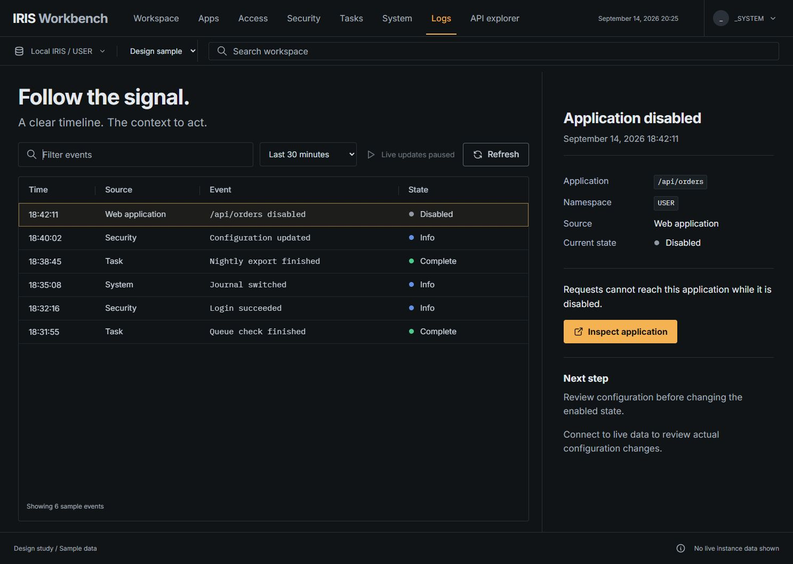

# IRIS Workbench

A local management portal for InterSystems IRIS. Inspect applications, follow events, review a change, and verify the result from the instance.

Built for the [InterSystems management portal contest](https://community.intersystems.com/post/intersystems-programming-contest-build-your-own-management-portal). Read the [project idea](IDEA.md), [demonstration](DEMO.md), [log coverage](LOGS.md), [verification record](VERIFICATION.md), and [design QA](design-qa.md).



Version 1.0.0. [MIT licensed](LICENSE). This is an independent community project, not an official InterSystems product.

## What works

1. Web application lists, configuration editing, creation and deletion with a review step.
2. Users, roles and resources, including role assignment and revocation.
3. Wallet collections and secrets, certificate import from paths on the IRIS server, certificate validity metadata, TLS configuration, OAuth server and client configuration.
4. Task definitions, creation, editing, run requests, suspension, resumption and history.
5. Processes and devices, controlled process suspension and resumption, CPU load, container and host memory, and disk capacity.
6. Runtime messages, audit events, task history, journal records, alerts and System Monitor logs, plus configured application text logs, file rotations, bounded gzip reads and older event paging.
7. A documented API explorer for reads and a session history of applied changes.

The design sample is explicitly fictional and does not write to IRIS. Live mode uses the actual connected instance. Read requests and changes run with the connected user's IRIS permissions.

## Requirements

Node.js 24.19.0 or later, pnpm 11.19.0, and Docker Desktop with Linux containers. Windows 11 x64 with Chrome and Edge is the verified local operator platform. The fresh setup uses the verified IRIS Community 2026.2 image, pinned by digest. Allow at least 3 GB for the IRIS container, plus the host's normal overhead.

## Get the versioned source

Download `iris-workbench_1.0.0_source.zip` and `SHA256SUMS` from the [v1.0.0 release](https://github.com/agammann/iris-workbench/releases/tag/v1.0.0). Check the ZIP before extracting:

```powershell
Get-FileHash .\iris-workbench_1.0.0_source.zip -Algorithm SHA256
Get-Content .\SHA256SUMS
Expand-Archive .\iris-workbench_1.0.0_source.zip -DestinationPath .\iris-workbench-v1
Set-Location .\iris-workbench-v1\iris-workbench-1.0.0
npm install --global pnpm@11.19.0
node --version
pnpm --version
```

The ZIP hash must match its line in `SHA256SUMS`; stop if it differs. The accompanying `release-manifest.json` identifies the exact source commit, tree, pinned Community image and API specification. The source ZIP contains the MIT license, frozen lockfile, backend and extension; it contains no private state or downloaded schema cache.

For a first try, use **Create a fresh local instance** below. For an instance you already manage, use **Run with your existing IRIS instance**. The design sample is fictional; selecting it does not establish a live connection. No hosted service, LLM or provider API key is required.

## Run with your existing IRIS instance

From this directory:

```powershell
pnpm install --frozen-lockfile
node scripts/fetch-spec.mjs
pnpm run build
$env:IRIS_URL = 'http://127.0.0.1:52773'
node server/index.mjs
```

Open [IRIS Workbench](http://127.0.0.1:3411). Enter an existing IRIS username and password in the connection form. The password remains in server memory for a one hour session and is never returned to the client. Sign out to remove the session. For a remote instance use HTTPS; the server rejects remote plaintext connections.

To enable runtime log and capacity views in a local Docker instance:

```powershell
$env:IRIS_CONTAINER = 'your-iris-container'
node scripts/install-iris.mjs
```

The installer loads the supplied classes into `%SYS` and creates or updates `/api/workbench`, using password authentication and `%Admin_Operate` access. It does not modify any other application. For a non Docker Linux installation, import the supplied classes in `iris/Workbench` into `%SYS`, copy `iris/workbench_logs.py` to `workbench/workbench_logs.py` under the active IRIS manager directory, and configure that REST application with the same authentication and resource settings. The text reader and capacity collector target Linux IRIS instances. The Windows host used for this project runs IRIS in a Linux Docker container.

## Create a fresh local instance

Choose an unused local port and an empty private state directory outside the repository. The setup refuses to overwrite an existing container or credential file.

```powershell
pnpm install --frozen-lockfile
node scripts/fetch-spec.mjs
pnpm run build
$env:IRIS_CONTAINER = 'iris-workbench-local'
$env:IRIS_PORT = '52773'
$env:WORKBENCH_STATE_DIR = 'C:/path/to/private/workbench-state'
node scripts/setup-local.mjs
node scripts/start-local.mjs $env:WORKBENCH_STATE_DIR
```

Setup creates a new Community container, generates a random local administrator credential, installs the extension, and verifies a runtime log read. The generated credential is stored only in your private state directory. The database itself stays inside this new container; the state directory is connection information, not a database backup. The portal offers **Connect local instance** for this configuration. Do not include that directory in source control, archives or support reports.

On macOS or Linux, set the same environment variables using your shell's `export` command and use an appropriate private state path.

## Upgrade, recovery and support

Keep the previous source folder and the private state directory when upgrading Workbench. Stop only its Node process, install and build the new source in another directory, then restart it with the same connection file. An app upgrade does not recreate your IRIS container. Follow [operations and recovery](docs/operations.md) for extension updates, partial setup, database backups and removal boundaries.

For help, use the [issue tracker](https://github.com/agammann/iris-workbench/issues) with the Workbench version, Node/pnpm/Docker versions, IRIS version and image digest, affected view, expected result and sanitized error. Omit credentials, wallet values, certificates/private keys, raw instance logs and your private state directory. See [contributing](CONTRIBUTING.md) and [security reporting](SECURITY.md).

## Development

Keep the backend running on port 3411, then run `pnpm dev` for the Vite frontend at [port 5173](http://127.0.0.1:5173). Vite proxies the portal API to the backend. The production command `node server/index.mjs` serves the built client and backend together. Ports bind to loopback by default.

```powershell
pnpm test
pnpm run build
pnpm run test:sites
pnpm audit
```

`pnpm test` covers request boundaries and setup failures. To exercise the log reader inside a running IRIS container, select that container explicitly:

```powershell
$env:IRIS_CONTAINER = 'your-iris-container'
pnpm run test:logs
```

The log checks create temporary fixtures under `/tmp/workbench-verification` in the selected container. The Python helper needs Linux directory file descriptors; run its tests in the chosen Linux container, not directly on Windows. A missing Docker executable or failed Docker command causes the check to fail.

To check a committed release package without creating a container:

```powershell
pnpm package:release
pnpm test:consumer
```

Packaging requires Git and a clean committed source tree. Python 3.12 is required by the archive verifier. The extracted consumer installs with the frozen lockfile, downloads and verifies the pinned schema, builds and runs the Node and static packaging tests. CI runs this on Linux and Windows, and runs the Linux log-reader suite separately. A live instance walkthrough remains a separate check; these package tests do not create or modify IRIS.

## Demonstration workflow

Follow [DEMO.md](DEMO.md) to create a disposable REST service, observe its HTTP 404 while disabled, enable it through the browser review flow, and verify HTTP 200 with a real JSON response. The script refuses to overwrite an existing application and provides an identity checked cleanup command.

The walkthrough also explains how to inspect the other five management areas. See the [verification record](VERIFICATION.md) for actual permission, task execution, process control and security lifecycle evidence.

## Operational boundaries

The portal is intended for a local operator, with one configured IRIS instance per server process. It is not a public multiuser hosted service. Public static hosting alone cannot run its Node backend or connect to your local IRIS instance.

Reviews expire after two minutes and existing objects are checked immediately before writes. This is a best effort conflict check, not an atomic transaction across the read and write. Result text distinguishes accepted operations from field readback. There is no automatic rollback.

Secret retrieval endpoints are blocked in the explorer, and structured sensitive fields are redacted in responses and reviews. Logs can contain application supplied text; this is not a universal log redaction service. Session history is held in memory and disappears on server restart. IRIS audit settings determine durable auditing.

Log reads are bounded. Uncompressed text files page backward in windows of at most 256 KiB and 200 lines. The source catalogue supports the configured console location, rotations, small gzip archives and explicitly configured application text logs. Alerts may be absent until IRIS creates the file. See [LOGS.md](LOGS.md) for exact limits and configuration. Optional binary subsystem formats, Windows event logs and interoperability message bodies are outside the text reader; do not advertise universal access to every IRIS log.

OAuth configuration tests do not establish successful authorization with a real identity provider. Certificate import uses file paths on the IRIS host; browser file uploads are not implemented. Process suspension and resumption were verified on a disposable Workbench process; existing system processes were not changed.

## API specification and compatibility

The app uses the organizer's [API specification](https://github.com/intersystems-community/sysadmin-api-specification), pinned to commit `f764aea427e5c0b1dd08a4c18a0457e0ff7b3b34`. The download script checks its SHA256 digest. The upstream schema is a local cache excluded from source archives. The adapter corrects the OAuth client field `OAuth2ServerDefinition` to the observed `ServerDefinition` accepted by the verified IRIS 2026.2 implementation.

See [third party notices](THIRD-PARTY-NOTICES.md). The project source is provided under the [MIT license](LICENSE). Open Exchange moderation and contest acceptance are separate from source publication. See [release status](RELEASE.md) for the recorded delivery state.

## Troubleshooting

| Symptom | Action |
| :--- | :--- |
| Could not connect to IRIS | Confirm the Linux container is running, the configured port matches, and the username has access to the requested management APIs. |
| Runtime extension HTTP error | Run the installer against the intended container. Confirm all three classes compiled and the helper file is present. `%Admin_Operate` is required for extension reads. |
| A view returns Forbidden | Workbench uses the connected user's IRIS permissions. Sign in with an appropriately authorized account; the portal does not grant itself privileges. |
| Older log page says the file changed | Select Latest events to start from the new file state. |
| A configured log is absent | Check its path inside the IRIS container, file permissions and LOGS.md. Select Reload sources. |
| Task does not run immediately | A run request can wait for the next scheduler tick. Inspect task history for actual execution. |
| Port 3411 is occupied | Set `PORT` before starting the production server. For frontend development, update the Vite proxy consistently. |
| Missing server/spec.json | Run `node scripts/fetch-spec.mjs`. The cache is intentionally excluded from source control. |
